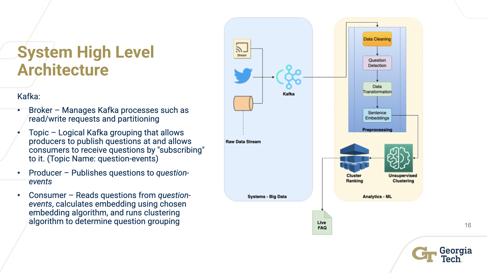

# CS6220-BigData-LiveFAQ
CS6220 Fall 2022 Big Data Systems and Analytics Project: Live FAQ 

## Clustering example

## System

## Clustering animation

### Running the clustering animation script
- Make sure you have [Processing](https://processing.org/download);
- Use Processing to open `clustering_animation/clustering_animation.pde`;
- Use the Play button on th Processing IDE to run the animation.

## Contributors
- Rishabh Thukral
- Akash Nainani
- Prahlad Jasti
- Anshul Gupta
- Andrea Covre
